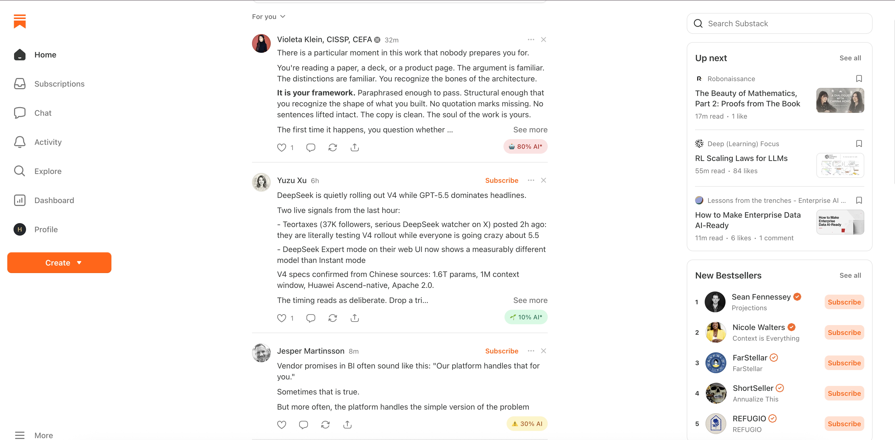
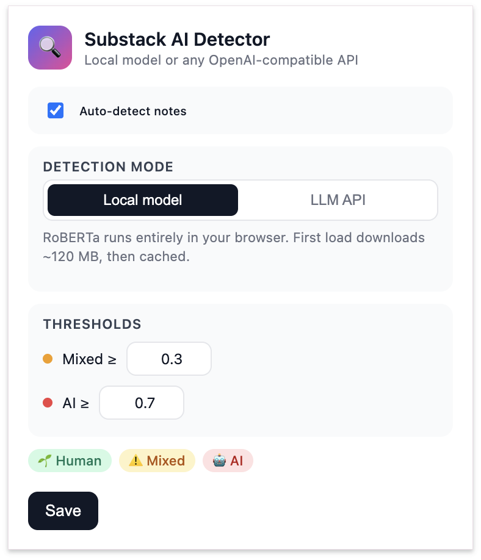
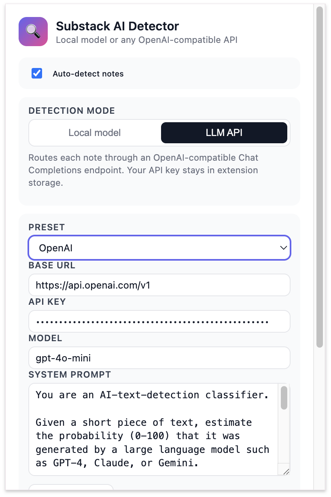

# Substack AI Detector

A Chrome extension that flags AI-generated **Substack notes** in real time.

Each note grows a small color-coded pill next to its reply icons:

| Color      | Score    | Meaning                  |
| ---------- | -------- | ------------------------ |
| 🌱 Green   | 0–30%    | Likely human-written     |
| ⚠️ Yellow  | 30–70%   | Mixed / uncertain        |
| 🤖 Red     | 70–100%  | Likely AI-generated      |
| `*` suffix | —        | Note was collapsed by Substack — score is based on the visible part only |
| `• N/A`    | —        | Body too short to score reliably (link-card-only shares, image notes) |

You can score notes with either a **local RoBERTa model** (zero config, runs entirely in the browser) or any **OpenAI-compatible LLM API** (OpenAI, DeepSeek, OpenRouter, Ollama, LM Studio, custom…).

## Screenshots

### In the Substack feed
Badges appear next to the reply icons of every note. Hover any badge to see the AI probability and the exact text that was analyzed.



### Popup — Local model
Default mode. RoBERTa runs entirely in the browser; nothing leaves your device.



### Popup — LLM API
Switch to LLM API to route every note through OpenAI / DeepSeek / Ollama / LM Studio / any OpenAI-compatible endpoint. The system prompt and per-note thresholds are fully editable.



---

## Table of contents

- [Install](#install)
- [Pick a detection mode](#pick-a-detection-mode)
  - [Local model](#local-model-default)
  - [Cloud LLM API (OpenAI / DeepSeek / OpenRouter)](#cloud-llm-api)
  - [Local LLM (Ollama / LM Studio)](#local-llm-ollama--lm-studio)
  - [Custom endpoint](#custom-endpoint)
- [Popup configuration](#popup-configuration)
- [Build from source](#build-from-source)
- [Architecture](#architecture)
- [Troubleshooting](#troubleshooting)
- [Limitations](#limitations)
- [License](#license)

---

## Install

1. Build (or grab a prebuilt `dist/`).
2. Open `chrome://extensions` and toggle **Developer mode** (top-right).
3. Click **Load unpacked** and select the `dist/` folder.
4. Visit any Substack page — open `https://substack.com/notes`, your home feed, or any post — and badges will appear next to each note.

That's it. Default mode is **local**; no key, no setup.

---

## Pick a detection mode

Click the extension icon in the toolbar to open the popup, then choose **Local model** or **LLM API**.

### Local model (default)

Runs [`onnx-community/roberta-base-openai-detector-ONNX`](https://huggingface.co/onnx-community/roberta-base-openai-detector-ONNX) inside the browser via `@huggingface/transformers` (ONNX Runtime Web).

- **First load:** downloads ~120 MB from `hf-mirror.com` and caches it in IndexedDB. Takes 30 s – 2 min depending on your network.
- **Subsequent loads:** served instantly from cache; no network required.
- **Privacy:** every note stays on your device. Nothing is sent anywhere.
- **Caveats:** trained on English GPT-2 outputs; weak on non-English text and on GPT-4/Claude. Best for triage, not forensic-grade attribution.

> If you're outside mainland China and prefer the official HuggingFace CDN, change `env.remoteHost` in `src/providers/local.ts` to `https://huggingface.co`.

### Cloud LLM API

Choose **LLM API** in the popup, then pick a preset:

| Preset       | Base URL                          | Suggested model       |
| ------------ | --------------------------------- | --------------------- |
| OpenAI       | `https://api.openai.com/v1`       | `gpt-4o-mini`         |
| OpenRouter   | `https://openrouter.ai/api/v1`    | `openai/gpt-4o-mini`  |
| DeepSeek     | `https://api.deepseek.com/v1`     | `deepseek-chat`       |

Steps:

1. Pick a preset (auto-fills *Base URL* and *Model*).
2. Paste your **API Key**.
3. Click **Test connection** — should show "OK — Returned score: 0".
4. Click **Save**.
5. Reload your Substack tab. New notes are scored via the LLM.

Cost reference (gpt-4o-mini): ~$0.0001 per note → ~1 ¢ per 100 notes.

### Local LLM (Ollama / LM Studio)

Run a model on your own machine. Free, private, no API key.

#### Ollama

```bash
brew install ollama          # or: see https://ollama.com
ollama pull llama3.2         # or any model you like
```

Open the popup, select preset **Ollama**, ensure:
- Base URL: `http://localhost:11434/v1`
- Model: matches an entry in `ollama list` (e.g. `llama3.2`, `qwen2.5:1.5b`)

Click **Test connection**. The extension automatically strips the `Origin` header for `localhost` traffic via `declarativeNetRequest`, so you do **not** need to set `OLLAMA_ORIGINS` yourself.

> First inference may take 10–30 s while Ollama loads the model into RAM. The default request timeout is 90 s. If you have an old machine, prefer a small model like `qwen2.5:1.5b` or `tinyllama`.

#### LM Studio

Start LM Studio's local server (default port 1234), load a chat model, then in the popup pick the **LM Studio** preset and click **Test connection**.

### Custom endpoint

Any service that speaks OpenAI's `/v1/chat/completions` works:

- vLLM, llama.cpp server, sglang, Together, Fireworks, Groq, Anthropic compat shims, etc.
- Pick the **Custom** preset and fill in *Base URL* / *Model* / *API Key*.

If your endpoint is on a non-localhost host that's not in the bundled `host_permissions`, Chrome will warn that the extension can't reach it. Either add the host to `src/manifest.config.ts` and rebuild, or grant the optional `<all_urls>` permission from `chrome://extensions`.

---

## Popup configuration

| Field             | What it does                                                                |
| ----------------- | --------------------------------------------------------------------------- |
| Auto-detect notes | Master on/off switch                                                        |
| Detection mode    | Local model vs. LLM API                                                     |
| Preset            | Auto-fills Base URL + Model. Choose **Custom** to manually configure.       |
| Base URL          | OpenAI-compatible endpoint root (e.g. `https://api.openai.com/v1`)          |
| API Key           | Bearer token. Stored in `chrome.storage.local` only; never leaves the SW.   |
| Model             | Model identifier passed to the API                                          |
| System prompt     | Tells the model how to score AI probability (defaults to a sensible prompt) |
| Test connection   | Sends a tiny "Hello, world." request and reports back                       |
| Mixed ≥ / AI ≥    | Score thresholds for the yellow / red badges                                |
| Save              | Persists settings; reload Substack tabs to apply                            |

The default system prompt is:

```text
You are an AI-text-detection classifier.

Given a short piece of text, estimate the probability (0-100) that it
was generated by a large language model such as GPT-4, Claude, or Gemini.

Consider: unnatural fluency, generic phrasing, AI-typical vocabulary
(e.g. "delve", "leverage", "tapestry", "vibrant"), overly uniform
sentence lengths, overuse of em dashes, structured paragraphs without
a personal voice.

Output ONLY a single integer from 0 to 100. No explanation, no
punctuation, no words.
```

You can rewrite it however you want — for example, to focus on a specific writing style or to score in a different scale (the parser handles `0–1`, `0–100`, "Score: 72%", etc.).

---

## Build from source

### Requirements

- Node.js ≥ 18
- npm

### Install + build

```bash
git clone <this-repo>
cd substack-ai-detector

npm install        # also runs scripts/copy-wasm.js (copies ONNX runtime)
npm run build      # outputs to dist/
```

Then **Load unpacked** the `dist/` folder in `chrome://extensions`.

### Dev server with HMR

```bash
npm run dev
```

After the first build completes, reload the unpacked extension in Chrome. Changes to popup / content scripts hot-reload.

### Replacing the placeholder icons

`scripts/make-placeholder-icons.js` generates flat-color squares so the build doesn't fail. To use real artwork, drop your own PNGs in `public/icons/`:

```
icon-16.png  icon-32.png  icon-48.png  icon-128.png
```

---

## Architecture

```
┌────────────────────────────────────────────────────────────────┐
│                       Substack page                             │
│                                                                 │
│  ┌──────────────────────────┐                                   │
│  │ content/index.ts         │   classic loader (177 B)          │
│  │  └─ dynamic import →     │                                   │
│  └──────────────────────────┘                                   │
│                │                                                │
│                ▼                                                │
│  ┌──────────────────────────────────────────────────────────┐   │
│  │ content/main.ts (ES module)                              │   │
│  │   • MutationObserver → extractor.ts → notes              │   │
│  │   • createProvider(settings) → LocalProvider | OpenAI   │   │
│  │   • badge.ts → injects pill into reaction bar            │   │
│  └──────────────────────────────────────────────────────────┘   │
│                │                              │                 │
│        local   │                              │  api            │
│                ▼                              ▼                 │
│   ┌──────────────────────┐    ┌──────────────────────────────┐  │
│   │ providers/local.ts   │    │ providers/openai.ts          │  │
│   │  transformers.js     │    │  chrome.runtime.sendMessage  │  │
│   │  (RoBERTa ONNX)      │    │            │                 │  │
│   └──────────────────────┘    └────────────┼─────────────────┘  │
└─────────────────────────────────────────────┼────────────────────┘
                                              │
                                              ▼
                          ┌─────────────────────────────────────┐
                          │ background/index.ts (service worker)│
                          │  fetch → /v1/chat/completions       │
                          │  parses score, returns to caller    │
                          └─────────────────────────────────────┘
```

### Key files

```
src/
├── manifest.config.ts            ← MV3 manifest (typed via @crxjs)
├── content/
│   ├── index.ts                  ← classic-script loader (avoids `import.meta` issue)
│   ├── main.ts                   ← orchestrator: scan → detect → render
│   ├── extractor.ts              ← Substack DOM parsing (resilient to class changes)
│   └── badge.ts                  ← pill UI + injection
├── providers/
│   ├── types.ts                  ← Provider interface, presets, default settings
│   ├── local.ts                  ← in-browser RoBERTa via @huggingface/transformers
│   ├── openai.ts                 ← OpenAI-compatible HTTP (delegates to SW)
│   └── index.ts                  ← createProvider() factory
├── background/
│   └── index.ts                  ← MV3 service worker — proxies all LLM HTTP
└── popup/
    ├── index.html
    ├── main.ts
    └── style.css
```

### Cross-cutting concerns

- **Module loading.** MV3 forbids `type: "module"` content scripts, but `import.meta` is needed by transformers.js. We register a tiny *classic* loader and have it `import(chrome.runtime.getURL('src/content/main.js'))` to bring in the real ES module bundle.
- **CORS / origin handling.** Both `hf-mirror.com` (model download) and Ollama (`localhost`) reject the extension's default `Origin` header. `public/rules.json` uses `declarativeNetRequest` to strip headers and inject permissive CORS responses, so neither needs server-side configuration.
- **API isolation.** All LLM HTTP goes through the service worker, not the content script, to keep API keys out of the Substack page context and avoid page-CSP entanglement.

---

## Troubleshooting

| Symptom | Likely cause / fix |
| --- | --- |
| Badges never appear | Reload the extension card *and* reload the Substack tab. Check for `[AI Detector]` errors in the page console. |
| `Cannot use 'import.meta' outside a module` | You loaded an old `dist/`. Run `npm run build`, then **Remove + Load unpacked** the new `dist/`. |
| Page console shows CORS errors for `hf-mirror.com` | The `declarativeNetRequest` ruleset isn't active. Make sure you didn't disable the extension's permissions. |
| Page shows `<!DOCTYPE` JSON parse error | hf-mirror returned a referer-blocked HTML page. Already handled by `rules.json`; if it persists, clear `transformers-cache` IndexedDB on `substack.com` and reload. |
| Local model: `Failed to fetch` | Network blocked. Try a VPN or change `env.remoteHost` in `src/providers/local.ts`. |
| Ollama `403` | Old build. The current build strips `Origin` for `localhost` automatically. Rebuild if needed. |
| Ollama `404 page not found` | Wrong endpoint — must end in `/v1` (e.g. `http://localhost:11434/v1`), not `/api/...`. |
| `channel closed before a response was received` | Background SW timed out. The default is 90 s; if your model is slow, preheat with `ollama run <model> "hi"`. |
| Multiple badges on one note | DOM ambiguity. Should be fixed for current Substack layouts; if you see it on a new layout, file an issue with the note's `outerHTML`. |

### Where to find logs

- **Page console** (right-click Substack page → Inspect → Console) — content script + extractor errors.
- **Service-worker console** (`chrome://extensions` → click *Service worker* under the extension card) — LLM HTTP errors, including the full request URL.
- **Extension errors button** — `chrome://extensions` shows a red **Errors** button if anything threw at load time.

---

## Limitations

- **Tuned for English prose.** The local RoBERTa model was trained on GPT-2 outputs; it under-performs on Chinese and other languages, and has weaker recall on GPT-4 / Claude. Use the LLM API mode (with a smart model and a custom prompt) for non-English content.
- **Short text is unreliable.** Notes under ~120 characters (link-card titles, single-emoji replies) often produce extreme false positives in any classifier. Treat short-note scores as noise.
- **Model can't see images.** Note threads that are mostly images + a tiny caption will be scored on the caption only.
- **Substack DOM drift.** Substack changes class names every few weeks. The extractor uses multiple fallbacks (data-testid, button-up discovery), but a particularly aggressive redesign may need a tweak.

---

## License

MIT
